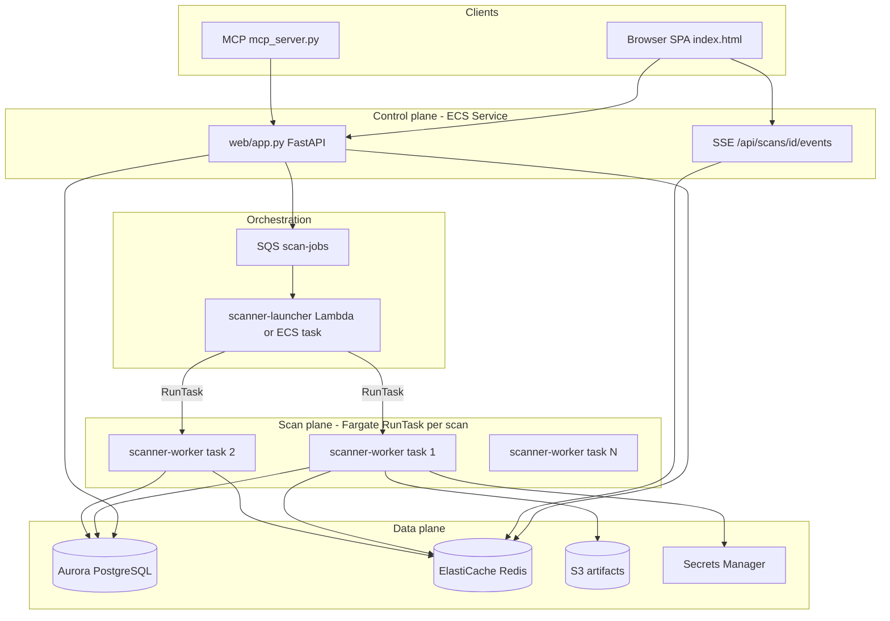

# Scalable Scanner Platform — Architectural Proposal

**Branch:** `feature/scalable-scanner-platform`  
**Status:** Proposal (no implementation yet)  
**Author:** AI DAST platform architecture review  
**Date:** 2026-05-27  

This document proposes decoupling the **control plane** (FastAPI UI + API + auth) from the **scan plane** (LLM agent + Playwright + tool execution), moving durable state to **PostgreSQL**, live telemetry to **Redis pub/sub + SSE**, and scan execution to **one AWS Fargate task per scan**. It is written against the codebase as it exists on `master` today.

Prior discussion of this direction appears in agent transcript [Scalable Fargate platform](9dc24a95-7c75-4d61-854b-359d0e1e9d8a).

---

## Table of contents

1. [Current architecture](#1-current-architecture-1-page-summary)
2. [Goals and constraints](#2-goals--constraints)
3. [Proposed target architecture](#3-proposed-target-architecture)
4. [Direct answers](#4-direct-answers-to-specific-questions)
5. [Migration plan](#5-migration--phased-rollout-plan)
6. [Risks and open questions](#6-risks--open-questions)
7. [Recommended next steps](#7-recommended-next-steps-concrete-first-prs)

---

## 1. Current architecture (1-page summary)

### What runs where today

A **single Docker container** (`dast-scanner`) on one **EC2 instance** (`3.20.180.251`) runs everything:

| Layer | Location | Role |
|-------|----------|------|
| HTTP API + UI | `web/app.py` (FastAPI + Uvicorn) | Scan CRUD, auth, results API, static SPA |
| Scan engine | `scanners/ai_agent/agent.py`, `orchestrator.py` | LLM loop, phases, Playwright, tools |
| LLM routing | `scanners/ai_agent/llm_config.py` | Bedrock / LiteLLM, retries, cost |
| Auth (target + platform) | `scanners/ai_agent/auth.py`, `scanners/auth/` | Target login; SAML/RBAC for UI |
| Users | `scanners/users/`, `web/routes_users.py` | Invites, roles |
| Persistence | `web/db.py` → SQLite `results/scanner.db` | Scan metadata, results JSON, users |
| Frontend | `web/static/index.html` | Single-page UI, 2s polling |
| Deploy | `Dockerfile`, EC2 `docker cp` + `docker restart` | Monolith image |

**Important correction:** The stack is **FastAPI**, not Flask. All references below use actual file paths.

### In-memory vs durable state

```text
┌─────────────────────────────────────────────────────────────────────────┐
│  EC2 host (3.20.180.251)                                                │
│  ┌───────────────────────────────────────────────────────────────────┐  │
│  │  Docker: dast-scanner (ONE process — uvicorn web.app:app)         │  │
│  │                                                                   │  │
│  │   Browser ──► POST /api/scan ──► SCANS[scan_id] dict (RAM)        │  │
│  │                      │              │                             │  │
│  │                      │              ├── live_tests[]  (~20MB)   │  │
│  │                      │              ├── live_findings[]           │  │
│  │                      │              ├── live_phases[]             │  │
│  │                      │              ├── LLM message history       │  │
│  │                      │              ├── Playwright browser ctx    │  │
│  │                      │              └── CANCEL_FLAGS / PAUSE_FLAGS│  │
│  │                      │                                            │  │
│  │                      └── threading.Thread ──► _run_scan_in_thread │  │
│  │                              └── asyncio ──► run_scan() agent.py  │  │
│  │                                                                   │  │
│  │   Periodic _save_scan() ──► SQLite (metadata + snapshot blob)    │  │
│  │   On complete ──► scan_results.payload + results/raw/*.json      │  │
│  └───────────────────────────────────────────────────────────────────┘  │
│                                                                         │
│  deploy = docker restart  ──►  ALL in-flight scans LOST                 │
│  (scripts/check_scan_active.py blocks deploy if status ∈ running/...)   │
└─────────────────────────────────────────────────────────────────────────┘
```

**`SCANS`** is declared in `web/app.py` line ~196:

```python
SCANS: dict[str, dict] = {}
```

On startup, `_load_scans_from_disk()` hydrates `SCANS` from SQLite but **does not** restore a running agent: any scan with `status == "running"` is flipped to `"error"` with message *"Server restarted during scan"*.

### Scan lifecycle (today)

1. **Trigger:** `POST /api/scan` in `web/app.py` (`start_scan`) — validates body, resolves model, sets `owner_user_id`, creates `scan_id`, allocates `CANCEL_FLAGS` / `PAUSE_FLAGS`, optionally `INTERACTIVE_BROWSERS`.
2. **State init:** `SCANS[scan_id] = { status: "running", progress: [], ... }` then `_save_scan(scan_id)` → SQLite row in `scans` + JSON `data` blob (without full `live_tests`).
3. **Execution:** `threading.Thread(target=_run_scan_in_thread, daemon=True)` → new asyncio loop → `_run_scan_task` → `run_scan()` from `scanners/ai_agent/agent.py` with `on_progress` callback wiring into `SCANS[scan_id]["live_*"]`.
4. **Live UI:** `web/static/index.html` — `setInterval(pollLiveView, 2000)` calls:
   - `GET /api/scan/{id}` — status, progress, slim findings
   - `GET /api/scan/{id}/live?since_test=&since_finding=` — incremental tests/findings/phases from **RAM only**
5. **Completion:** Updates `SCANS`, writes `save_results()` → file + `scandb.save_scan_result()`, triage, `_save_scan`.
6. **Results read:** `GET /api/results/{scan_id}` reads `SCANS` and/or `scan_results` table / `results/raw/`.

### Database (today)

SQLite via `web/db.py` (`results/scanner.db`). Tables: `scans`, `scan_results`, `cost_ledger`, `app_kv`, `users`, `invites` (see `db/README.md`, `db/schema.sql`).

- **Source of truth for completed results:** `scan_results.payload` (with legacy JSON file fallback).
- **NOT in DB during scan:** full `live_tests` tool log (only on graceful stop/complete in payload); LLM conversation; Playwright session.

### WebSockets (today)

WebSockets exist **only** for:

- Interactive MFA browser (`browser_websocket` on scan)
- Workflow recorder (`workflow_recorder_ws`)

**Live scan telemetry is HTTP polling**, not WebSocket.

### Pain points implied by design

| Pain point | Cause | Operational impact |
|------------|--------|-------------------|
| No deploy during scan | Process holds browser + LLM state in RAM | `deployment-protocol.mdc` + `check_scan_active.py` |
| Restart = scan death | No checkpoint of agent loop / browser | Users see `"Server restarted during scan"` |
| Pause-deploy-resume fails | Same process must survive | Documented explicitly in rules |
| Scale = vertical only | One container, N daemon threads | CPU/RAM contention; Bedrock throttling |
| Live view tied to API process | `/live` reads `SCANS` dict | Cannot split UI and scanner |
| SQLite on single host | File DB in container volume | No HA, awkward multi-writer for workers |
| Thread-per-scan on one host | `threading.Thread` in `start_scan` | Memory spikes with parallel scans |

---

## 2. Goals & constraints

### Product goals

| Goal | Requirement |
|------|-------------|
| On-demand scans | User clicks Start → work begins without manual EC2 ops |
| Horizontal scale | Many concurrent scans across many workers |
| UI ↔ scanner decoupling | UI never reads worker RAM; only DB + event stream |
| Live phase visibility | Phase started/completed, tool activity, findings as they appear |
| Final report from DB | Completed scans served from Postgres (+ S3 artifacts) |
| Deploy freedom | Ship new **UI/API** or **worker** images without killing in-flight scans |

### Technical constraints

- Scans are **long-running** (15–90+ minutes), not batch jobs under 15 minutes.
- Each scan needs **Playwright + Chromium** (~1.5–3 GB RAM realistic).
- **LLM tool-calling** requires sustained TCP to Bedrock; Lambda is a poor fit.
- Existing auth: **SAML SSO + RBAC** (`scanners/auth/`, `scanners/users/`).
- Regression gate on `web/app.py`, `agent.py`, `llm_config.py`, auth, users (`deployment-protocol.mdc`).
- Must preserve MCP/API clients (`mcp_server.py` polls same REST surface).

### Non-goals (for initial phases)

- Multi-region active-active
- Customer-managed VPC peering per tenant
- Replacing triage engine (`scripts/triage_engine.py`) — stays offline/deterministic

---

## 3. Proposed target architecture

### Opinionated summary

| Decision | Choice |
|----------|--------|
| Compute | **Fargate: 1 scan = 1 task** |
| Orchestration | **API → SQS → launcher service → `ecs:RunTask`** |
| Primary DB | **PostgreSQL (Aurora Serverless v2)** |
| Live events | **Redis (ElastiCache) pub/sub + SSE from API** |
| Artifacts | **S3** |
| Secrets | **AWS Secrets Manager** (+ SSM for non-secret config) |
| UI service | **ECS Fargate service** (always-on, small) separate from workers |

### Target diagram



```text
                    ┌──────────────┐
                    │   Route 53   │
                    └──────┬───────┘
                           │
                    ┌──────▼───────┐
                    │     ALB      │
                    └──────┬───────┘
           ┌───────────────┼───────────────┐
           │               │               │
    ┌──────▼──────┐ ┌──────▼──────┐       │
    │  API/UI     │ │  SSE stream │       │
    │  (Fargate   │ │  (same API  │       │
    │   service)  │ │   process)  │       │
    └──────┬──────┘ └──────┬──────┘       │
           │               │               │
           └───────┬───────┘               │
                   │                       │
         ┌─────────▼─────────┐   ┌───────▼────────┐
         │ Aurora PostgreSQL │   │ ElastiCache    │
         │ scans, findings,  │   │ Redis pub/sub  │
         │ phase_logs, users │   │ scan:{id}:evt  │
         └─────────▲─────────┘   └───────▲────────┘
                   │                     │
    ┌──────────────┴─────────────────────┴──────────────┐
    │  SQS scan-jobs  ──►  launcher  ──►  ECS RunTask   │
    │                         │              │          │
    │                    ┌────▼────┐    ┌────▼────┐     │
    │                    │ Task 1  │    │ Task 2  │ ... │
    │                    │ worker  │    │ worker  │     │
    │                    └────┬────┘    └────┬────┘     │
    └─────────────────────────┼──────────────┼─────────┘
                              │              │
                         ┌────▼──────────────▼────┐
                         │ S3: artifacts, reports │
                         └────────────────────────┘
```

---

### 3.1 Compute layer — one scan per Fargate task

**Recommendation: YES — one scan per container (Fargate task).**

| Reason | Detail |
|--------|--------|
| Isolation | Playwright + Chromium leak memory; OOM in one scan must not kill others |
| Blast radius | Runaway LLM loop or fork bomb contained to one task |
| Parallelism | Scale by task count, not threads in one Python process |
| Lifecycle | Task exit = natural completion signal; no orphan threads |
| Resource sizing | Per-scan CPU/RAM (e.g. 2 vCPU / 4 GiB) tuned for browser + LLM |
| Deploy | New worker image only affects **new** tasks; running tasks keep old image until done |
| Restart safety | ECS task stop → scan row → `error`/`cancelled` in DB; partial findings already flushed |

**Alternatives considered:**

| Alternative | Why rejected |
|-------------|--------------|
| **ECS service, multi-scan worker** | Shared process reintroduces today's thread/RAM contention; harder per-scan timeouts |
| **Lambda** | 15 min max (even with tweaks insufficient); no Playwright; cold start + no persistent browser |
| **EC2 ASG with multiple scans per instance** | Better than one container, but still shared kernel OOM risk; ops heavier than Fargate |
| **Kubernetes Job per scan** | Valid if org standardizes on EKS; Fargate is simpler if AWS-native |

**Worker entrypoint (new):** `scanner_worker/__main__.py` or `scripts/run_scan_worker.py`:

```bash
python -m scanner_worker --scan-id <uuid>
```

Imports existing `run_scan()` from `scanners/ai_agent/agent.py` with injected `EventPublisher` instead of mutating global `SCANS`.

**Fargate task sizing (starting point):**

| Profile | vCPU | Memory | Notes |
|---------|------|--------|-------|
| Standard web scan | 2 | 4096 MB | Playwright Chromium + Python |
| API-only (no browser) | 1 | 2048 MB | Optional lighter task definition |
| Deep / multi-identity | 2 | 6144 MB | Parallel phases in `run_phases_parallel` |

**Hard wall-clock timeout:** Stop task at **120 minutes** via Step Functions or ECS task stop + `scan.timeouts_at` in DB (see risks).

---

### 3.2 Orchestration — API → SQS → launcher → RunTask

**Recommendation: SQS queue + small launcher component that calls `ecs:RunTask`.**

| Option | Pros | Cons |
|--------|------|------|
| **Direct `RunTask` from API** | Fewest moving parts | API needs broad ECS IAM; slow/hung RunTask blocks request; no natural retry |
| **Step Functions → RunTask** | Visual workflow, built-in retries | Overkill for "start task"; state machine per scan adds cost/complexity |
| **SQS → launcher → RunTask** | Decoupled, backpressure, DLQ for poison messages, API stays fast | One more component |

**Flow:**

1. `POST /api/scan` (in refactored `web/app.py`):
   - Insert `scans` row (`status = queued`).
   - Publish message to SQS: `{ scan_id, task_definition_arn, subnets, security_groups, owner_user_id }`.
   - Return `{ scan_id, status: "queued" }` immediately.

2. **Launcher** (choose one):
   - **Lambda** triggered by SQS (simplest ops) — calls `ecs.run_task()`, updates scan → `starting`.
   - **Long-poll ECS service** (if Lambda concurrency limits bite) — same code, pulls SQS.

3. Worker container starts, reads `SCAN_ID` from env, runs agent, exits 0/1.

4. On failure after N SQS receives → **DLQ** + `scans.status = failed`.

**Why not Step Functions as primary orchestrator:** Scan phases are already orchestrated in Python (`agent.py`, `orchestrator.py`, `run_phases_parallel`). Duplicating phase state in Step Functions creates two sources of truth. Use Step Functions later only if you need cross-scan workflows (nightly regression suites).

**Files to add:**

| File | Purpose |
|------|---------|
| `infra/terraform/sqs.tf` or `cdk/lib/scan-queue.ts` | Queue + DLQ |
| `scanner_launcher/handler.py` | SQS → RunTask |
| `web/scan_queue.py` | `enqueue_scan(scan_id)` |
| `web/app.py` | Replace `threading.Thread` with enqueue |

---

### 3.3 State / database — PostgreSQL (Aurora Serverless v2)

**Recommendation: PostgreSQL as the single system of record.** Do **not** split live events into DynamoDB for the first production version.

| Store | Role |
|-------|------|
| **PostgreSQL** | Scans, findings, phase logs, users, targets, audit |
| **Redis** | Ephemeral pub/sub for live UI only (not source of truth) |
| **S3** | Large blobs (screenshots, raw test log JSON, PDF/HTML reports) |

**Why not DynamoDB for live events:**

- Relational queries (user's scans, filter by target, cost rollup) already map to SQL.
- Findings + triage joins are painful in DynamoDB.
- Team already has SQLite schema in `web/db.py` — migration path is `sqlite → postgres`, not greenfield NoSQL.

**Why Aurora Serverless v2:** Scales to near-zero in dev, handles connection pooling via RDS Proxy in prod, familiar Postgres.

#### Core tables

```sql
-- scans: one row per scan job
CREATE TABLE scans (
    scan_id           UUID PRIMARY KEY,
    owner_user_id     UUID NOT NULL REFERENCES users(id),
    target_id         UUID REFERENCES targets(id),
    target_url        TEXT NOT NULL,
    model             TEXT NOT NULL,
    scan_mode         TEXT NOT NULL,
    status            TEXT NOT NULL,  -- queued, starting, running, paused, completed, error, cancelled, failed
    scan_profile      TEXT,
    ecs_task_arn      TEXT,
    queued_at         TIMESTAMPTZ NOT NULL DEFAULT now(),
    started_at        TIMESTAMPTZ,
    finished_at       TIMESTAMPTZ,
    duration_sec      REAL,
    cost_usd          NUMERIC(12,6),
    findings_count    INT DEFAULT 0,
    current_phase     TEXT,
    error_message     TEXT,
    config_json       JSONB NOT NULL,  -- non-secret scan params (scope, focus_urls, intensity)
    artifact_prefix   TEXT,            -- s3://bucket/scans/{scan_id}/
    created_at        TIMESTAMPTZ NOT NULL DEFAULT now(),
    updated_at        TIMESTAMPTZ NOT NULL DEFAULT now()
);
CREATE INDEX idx_scans_owner ON scans(owner_user_id, created_at DESC);
CREATE INDEX idx_scans_status ON scans(status) WHERE status IN ('queued','starting','running','paused');

-- findings: normalized for UI + reporting (denormalized snapshot also in S3)
CREATE TABLE findings (
    finding_id        UUID PRIMARY KEY,
    scan_id           UUID NOT NULL REFERENCES scans(scan_id) ON DELETE CASCADE,
    title             TEXT NOT NULL,
    severity          TEXT NOT NULL,
    cvss              REAL,
    cvss_vector       TEXT,
    owasp_category    TEXT,
    url               TEXT,
    parameter         TEXT,
    phase             TEXT,
    payload           TEXT,
    evidence          TEXT,
    triage_verdict    TEXT,
    exploitation_tier TEXT,
    raw_json          JSONB,
    created_at        TIMESTAMPTZ NOT NULL DEFAULT now()
);
CREATE INDEX idx_findings_scan ON findings(scan_id);

-- phase_logs: append-only phase boundaries (replaces live_phases snapshots)
CREATE TABLE phase_logs (
    id                BIGSERIAL PRIMARY KEY,
    scan_id           UUID NOT NULL REFERENCES scans(scan_id) ON DELETE CASCADE,
    phase_id          TEXT NOT NULL,
    phase_name        TEXT,
    status            TEXT NOT NULL,  -- started, completed, error
    started_at        TIMESTAMPTZ,
    finished_at       TIMESTAMPTZ,
    tool_calls        INT DEFAULT 0,
    findings_added    INT DEFAULT 0,
    error             TEXT,
    meta_json         JSONB
);
CREATE INDEX idx_phase_logs_scan ON phase_logs(scan_id, id);

-- live_events: durable audit of stream events (optional but recommended)
CREATE TABLE live_events (
    id                BIGSERIAL PRIMARY KEY,
    scan_id           UUID NOT NULL REFERENCES scans(scan_id) ON DELETE CASCADE,
    seq               BIGINT NOT NULL,
    event_type        TEXT NOT NULL,  -- phase_started, phase_log, test_record, finding_added, progress, scan_complete
    payload           JSONB NOT NULL,
    created_at        TIMESTAMPTZ NOT NULL DEFAULT now(),
    UNIQUE (scan_id, seq)
);
CREATE INDEX idx_live_events_scan ON live_events(scan_id, seq);

-- users: migrate from SQLite users + invites
-- targets: saved target profiles (optional Phase 1+)
CREATE TABLE targets (
    target_id         UUID PRIMARY KEY,
    owner_user_id     UUID NOT NULL REFERENCES users(id),
    label             TEXT,
    base_url          TEXT NOT NULL,
    config_json       JSONB,  -- non-secret defaults; secrets via Secrets Manager ARN
    created_at        TIMESTAMPTZ NOT NULL DEFAULT now()
);
```

**Large payloads:** `live_tests` (full HTTP exchange log) → S3 object `scans/{id}/test_log.jsonl` with pointer on `scans.artifact_prefix`. Postgres holds summary counts only.

**Migration from SQLite:** Alembic migrations in new `db/migrations/`; one-time `scripts/migrate_sqlite_to_postgres.py` reading `results/scanner.db`.

**Files to change:**

| File | Change |
|------|--------|
| `web/db.py` | Replace sqlite3 with SQLAlchemy/psycopg3 + connection pool |
| `db/schema.sql` | Postgres canonical DDL |
| `scanners/users/repository.py` | Postgres backend |
| `web/app.py` | Repository calls instead of `SCANS` dict |

---

### 3.4 Live updates — SSE (not API Gateway WebSocket)

**Recommendation: Server-Sent Events (SSE) from the FastAPI control plane, fed by Redis pub/sub.**

| Transport | Fit for this UI |
|-----------|-----------------|
| **SSE** | **Best.** One-way scanner→browser; works through ALB; native `EventSource` in browser; reconnect with `Last-Event-ID` |
| **WebSocket** | Use only for **interactive browser** (already in `web/app.py`) — bidirectional, low latency |
| **Polling** | Keep as fallback; degrade gracefully |
| **API Gateway WebSocket** | Extra service; 10 min idle / 2 hr max connection limits; connection fan-out complexity |

**Why not Flask-SocketIO on ALB:** You're on FastAPI; `sse-starlette` or raw `StreamingResponse` is idiomatic. SocketIO adds sticky-session requirements.

**Event flow:**

```text
scanner-worker
    │
    ├─► INSERT live_events + UPDATE scans (Postgres)     [durable]
    │
    └─► PUBLISH scan:{scan_id}  JSON event  (Redis)      [fast]

FastAPI (control plane)
    │
    ├─► SUBSCRIBE scan:{scan_id}  (Redis)
    │
    └─► SSE stream to browser: event: finding_added\ndata: {...}\n\n

Browser (index.html)
    └─► EventSource(`/api/scans/${id}/events`)
```

**Authentication:**

- SSE endpoint requires same session cookie / Bearer as REST (`scanners/auth/middleware.py`).
- Validate `scan.owner_user_id == current_user.id` (or admin) before subscribe.
- Issue short-lived **SSE token** (JWT, 5 min, scoped to `scan_id`) if cookie-only browsers struggle with cross-origin — optional.

**Reconnection:** Client sends `Last-Event-ID: <seq>`; API replays from `live_events` where `seq > last` then attaches to Redis.

**New endpoints:**

| Endpoint | File |
|----------|------|
| `GET /api/scans/{scan_id}/events` | `web/routes_events.py` |
| Worker publisher | `scanner_worker/events.py` |

**Frontend (`web/static/index.html`):**

- Replace `setInterval(pollLiveView, 2000)` with `EventSource` when available.
- Keep polling every 10s as watchdog for SSE failure.

---

### 3.5 Auth & multi-tenancy

Existing model in `scanners/auth/rbac.py`, `scanners/users/repository.py`:

| Layer | Enforcement |
|-------|-------------|
| REST | `auth_middleware` + per-route `owner_user_id` checks |
| SSE | Same session; verify scan ownership before Redis subscribe |
| SQS message | Include `owner_user_id`; worker **re-validates** scan row before execution |
| S3 artifacts | Prefix `scans/{scan_id}/`; IAM task role scoped; presigned URLs for download via API |
| Secrets | Target credentials: `secretsmanager:GetSecretValue` with resource tag `scan_id` or `target_id` — never in SQS body |

**Admin role:** Can list all scans (`GET /api/scans`) — preserve current admin behavior from RBAC tests (`tests/test_sso_rbac.py`).

---

### 3.6 Artifact storage (S3)

| Artifact | Path | Written by |
|----------|------|------------|
| Raw result JSON | `s3://{bucket}/scans/{scan_id}/result.json` | worker on complete |
| Test log JSONL | `s3://{bucket}/scans/{scan_id}/test_log.jsonl` | worker streaming |
| Screenshots | `s3://{bucket}/scans/{scan_id}/screenshots/` | tools.py / worker |
| PDF report | `s3://{bucket}/scans/{scan_id}/report.pdf` | API `scripts/report_generator.py` post-process |
| LLM transcripts (optional) | `s3://.../transcripts/` | debug flag only |

`web/app.py` `GET /api/results/{scan_id}` loads metadata from Postgres, streams large bodies from S3 presigned URLs.

---

### 3.7 Observability

| Signal | Implementation |
|--------|----------------|
| Logs | CloudWatch Logs per Fargate task; structured JSON (`scan_id`, `phase`, `model`) |
| Metrics | EMF or Prometheus sidecar: `scan_duration`, `findings_count`, `llm_calls`, `task_failures` |
| Traces | ADOT → X-Ray on worker (Bedrock + HTTP spans) |
| Dashboards | CloudWatch dashboard: active tasks, queue depth, DLQ depth, $/scan |
| Alerts | DLQ > 0, task OOM, scan stuck `running` > 120 min |

Worker hooks: wrap `LLMRouter.complete` in `scanners/ai_agent/llm_config.py` with span attributes.

---

### 3.8 Secrets

| Secret type | Store |
|-------------|-------|
| Bedrock / AWS | Task IAM role (no keys in env) |
| Target passwords | Secrets Manager `dast/target/{target_id}` JSON |
| SAML certs | Secrets Manager or SSM |
| `DAST_AUTH_PASS` (automation Basic Auth) | API/scripts/MCP only in prod; human operators use SSO only |

Worker receives `TARGET_SECRET_ARN` in task env, fetches at startup, never logs values.

---

### 3.9 Cost discussion

**Current (always-on EC2):**

- e.g. `m5.xlarge` ~$0.192/hr ≈ **$140/month** 24/7 regardless of scan count
- Plus Bedrock usage (dominant variable cost today via `live_cost` / `cost_ledger`)

**Proposed Fargate (per scan):**

Example: 2 vCPU, 4 GB, 45 min scan, us-east-2 pricing ≈ $0.04/vCPU-hr + $0.004/GB-hr:

- vCPU: 2 × 0.75 hr × $0.04 ≈ **$0.06**
- Memory: 4 GB × 0.75 hr × $0.004 ≈ **$0.012**
- **~$0.07–0.12 per scan-hour** infrastructure (excluding Bedrock)

At **10 scans/day × 45 min**: ~$30–50/month Fargate + **$0 EC2 scanner host** if EC2 retired.

**Aurora Serverless v2:** ~$45–90/month minimum with low ACU; use RDS Proxy.

**Redis:** `cache.t4g.small` ~$25/month.

**S3:** cents per GB for artifacts.

**Net:** Cheaper at low utilization; predictable per-scan unit economics at scale. Bedrock remains largest line item — add per-user quotas in Phase 5.

---

## 4. Direct answers to specific questions

### One scan per container — is that fine?

**Yes. Run exactly one scan per Fargate task.**

One container should own one Playwright browser, one LLM conversation chain, and one `cancel_flag` lifecycle. This mirrors how CI systems run one job per pod and eliminates the deploy-during-scan deadlock on the control plane: deploying the API service does not touch worker tasks already running.

### Live update via WebSocket?

**Use SSE for live scan telemetry; keep WebSocket only for interactive browser sessions.**

Scan progress is server→client. SSE is simpler behind ALB, reconnects cleanly, and avoids API Gateway WebSocket idle limits. WebSockets remain in `browser_websocket` for MFA/manual login where the client sends mouse/keyboard events.

### Database choice?

**PostgreSQL (Aurora Serverless v2)** — relational scan/findings model, migration from existing SQLite schema in `web/db.py`, and strong consistency for UI reads.

### Orchestrator choice?

**SQS → launcher → `ecs:RunTask`** — API returns fast, retries/DLQ are built-in, and the API does not need fragile synchronous ECS calls.

---

## 5. Migration / phased rollout plan

### Phase 0 — Postgres + dual-write (reversible)

**Goal:** Introduce PostgreSQL alongside SQLite; every `_save_scan` writes to both.

| Area | Changes |
|------|---------|
| Add | `db/migrations/001_initial.sql`, `web/db_postgres.py`, `docker-compose.dev.yml` with Postgres |
| Edit | `web/app.py` — `_save_scan`, `_load_scans_from_disk` dual-write |
| Edit | `requirements.txt` — `psycopg[binary]`, `alembic` |
| Flag | `DATABASE_URL` unset → SQLite only; set → dual-write |

**Validate:**

- Run existing pytest (`tests/test_results_endpoint_resilience.py`, etc.).
- Start scan; compare SQLite vs Postgres row counts.

**Rollback:** Disable `DATABASE_URL`; continue SQLite-only.

---

### Phase 1 — UI reads from DB

**Goal:** `GET /api/scans`, `GET /api/scan/{id}`, `GET /api/results/{id}` read Postgres first; `SCANS` is write-through cache for running scans only.

| Edit | `web/app.py` — `get_scan_status`, `list_scans`, `_get_results_inner` |
| Edit | `web/static/index.html` — no change if API shape stable |

**Validate:** Stop container mid-scan; UI still shows last persisted `phase_logs` / metrics from DB.

**Rollback:** Feature flag `READ_FROM_POSTGRES=false`.

---

### Phase 2 — Extract `scanner-worker` container

**Goal:** Scan runs in separate Docker image locally; UI on host talks via DB only.

| Add | `scanner_worker/Dockerfile`, `scanner_worker/main.py` |
| Edit | `web/app.py` — replace `threading.Thread` with subprocess or `docker run` (dev) |
| Edit | `scanners/ai_agent/agent.py` — accept `ProgressCallback` interface instead of closing over `SCANS` |

**Validate:** `docker compose up` — UI + worker; live data appears via DB polling.

**Rollback:** `WORKER_MODE=inline` restores in-process thread.

---

### Phase 3 — Live-event pub/sub (Redis + SSE)

**Goal:** Sub-second phase updates without hammering Postgres.

| Add | `scanner_worker/events.py`, `web/routes_events.py`, Redis in compose |
| Edit | `web/static/index.html` — `EventSource` + fallback poll |
| Edit | Worker — publish on each `on_progress` event |

**Validate:** Integration test subscribes to Redis; browser shows phase transition < 1s.

**Rollback:** SSE disabled; 2s polling reads DB `live_events`.

---

### Phase 4 — Fargate + SQS orchestration

**Goal:** Production path launches ECS task per scan; EC2 monolith retired or becomes API-only.

| Add | Terraform/CDK: cluster, task defs, SQS, launcher Lambda, RDS, ElastiCache, S3 |
| Edit | `web/scan_queue.py`, `web/app.py` `start_scan` |
| Deploy | API service to Fargate; workers RunTask |

**Validate:** Load test 5 parallel scans; deploy new API revision while scans run; scans complete.

**Rollback:** Point DNS to EC2 monolith; drain queue.

---

### Phase 5 — Production hardening

| Item | Implementation |
|------|----------------|
| Autoscaling | Launcher concurrency ∝ queue depth; Fargate capacity providers |
| Quotas | `max_concurrent_scans` per user in Postgres |
| Cost guards | Kill task when `cost_usd > budget` or duration > 120 min |
| DLQ playbooks | Alert + admin retry |
| WAF / rate limits | ALB + `POST /api/scan` throttle |

---

## 6. Risks & open questions

| Risk | Mitigation |
|------|------------|
| **Fargate cold start 30–60s** | Show `queued` / `starting` in UI; pre-warm optional tiny service; message sets expectations |
| **Playwright memory** | 4 GiB task def; API-only profile at 2 GiB |
| **Bedrock throttling** | Per-account rate limiter in worker; queue depth backoff |
| **SSE through corporate proxies** | Polling fallback; optional WebSocket upgrade path later |
| **Dual-write races (Phase 0)** | Postgres wins on read conflict; single-writer per `scan_id` |
| **Runaway scan cost** | Hard timeout + `stop_task` + budget column |
| **Interactive browser on Fargate** | Hard — needs VNC or break-glass EC2; defer or keep control-plane proxy |

### Questions for product owner before PR-1

1. **Postgres hosting:** Aurora Serverless v2 in existing AWS account, or RDS Postgres on EC2 for dev?
2. **EC2 retirement:** After Phase 4, is the current EC2 host fully decommissioned or kept as bastion?
3. **Parallel scan quota:** Default max concurrent scans per user (suggest **3**)?
4. **Interactive MFA browser:** Must it survive Fargate migration in v1, or can MFA use TOTP-only for first release?
5. **Region:** Stay `us-east-2` (current EC2 IP suggests Ohio)?

---

## 7. Recommended next steps (concrete first PRs)

All PRs on `feature/scalable-scanner-platform` → merge to `master` via review (no direct push).

### PR-1: Postgres schema + dual-write (Phase 0)

| Action | Path |
|--------|------|
| Add | `db/migrations/001_initial.sql` |
| Add | `web/db_postgres.py` (repository pattern) |
| Add | `alembic.ini`, `db/migrations/env.py` |
| Add | `docker-compose.yml` — `postgres:16`, `redis:7` |
| Edit | `web/app.py` — `_save_scan`, `_save_scans_to_disk`, `_load_scans_from_disk` |
| Edit | `web/db.py` — delegate or adapter |
| Add | `tests/test_db_dual_write.py` |
| Edit | `requirements.txt` |
| Edit | `db/README.md` |

**Commit message:** `feat(db): add Postgres schema and dual-write from scan saves`

### PR-2: UI reads from Postgres (Phase 1)

| Edit | `web/app.py` — list/get/results endpoints |
| Add | `tests/test_scan_reads_postgres.py` |

### PR-3: Progress callback abstraction (pre-worker)

| Edit | `scanners/ai_agent/agent.py` — `ScanContext` / callbacks |
| Edit | `web/app.py` — `ScansDictCallback` vs `DbCallback` |

### PR-4: `scanner-worker` image (Phase 2)

| Add | `scanner_worker/*`, `Dockerfile.worker` |
| Edit | `docker-compose.yml` |

### PR-5: Redis + SSE (Phase 3)

| Add | `web/routes_events.py`, `scanner_worker/events.py` |
| Edit | `web/static/index.html` |

### PR-6: Infra + SQS + Fargate (Phase 4)

| Add | `infra/` Terraform or CDK |
| Add | `scanner_launcher/handler.py` |

---

## Appendix A — File map (today → target)

| Concern | Today | Target |
|---------|-------|--------|
| API entry | `web/app.py` | `web/app.py` (control plane only) |
| Scan execution | `web/app.py` threads → `agent.py` | `scanner_worker/main.py` → `agent.py` |
| Live state | `SCANS[id].live_*` | Postgres + Redis |
| Persistence | `web/db.py` SQLite | `web/db_postgres.py` Aurora |
| UI | `web/static/index.html` | Same + SSE |
| Auth | `scanners/auth/*` | Unchanged |
| Deploy check | `scripts/check_scan_active.py` | Check SQS depth + ECS running tasks |
| Config | `config/scanner_config.yaml` | SSM Parameter Store |

## Appendix B — Event types (contract)

```typescript
type ScanEvent =
  | { type: "scan_status"; status: string; seq: number }
  | { type: "phase_started"; phase_id: string; phase_name: string }
  | { type: "phase_completed"; phase_id: string; tool_calls: number; findings_added: number }
  | { type: "finding_added"; finding: SlimFinding }
  | { type: "test_record"; test: object }  // optional/stream throttled
  | { type: "progress"; message: string }
  | { type: "scan_complete"; findings_count: number; cost_usd: number };
```

Publish after durable insert to `live_events` so SSE reconnect can replay.

## Appendix C — Replace `check_scan_active.py` logic

New pre-deploy check for **control plane only**:

```python
# scripts/check_deploy_safe.py
# 1. ECS: count RUNNING tasks for scanner-worker family == 0 OR allow deploy of API only
# 2. SQS: ApproximateNumberOfMessagesNotVisible (optional warning)
```

Deploying API service **must not** restart workers; deploying worker task definition **only affects new tasks**.

---

*End of proposal.*
