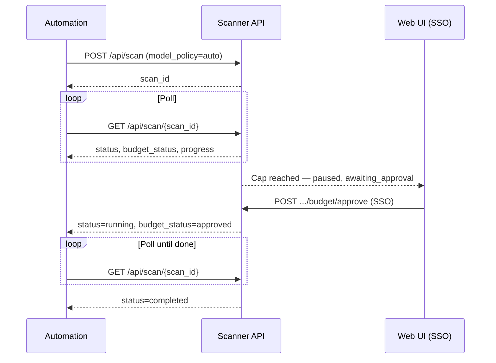

# Automation: MCP, OpenClaw, and REST API

Deep-dive for engineers driving the Red Team AI Web Scanner from **MCP** (Cursor / Claude Desktop), **OpenClaw** (`openclaw-skill/test_skill.py`), or **REST** (Basic Auth). For the non-developer Confluence overview, paste [`docs/confluence/automation-mcp-openclaw-api.xhtml`](confluence/automation-mcp-openclaw-api.xhtml) under the main scanner page.

Related: [intelligent-model-selection.md](intelligent-model-selection.md) · [api.md](api.md) · [mcp.md](mcp.md) · [openclaw-skill/README.md](../openclaw-skill/README.md)

---

## Scan IDs

Every launch returns the same identifier for the life of the job:

| Source | How you get `scan_id` |
|--------|------------------------|
| `POST /api/v1/scans` or `POST /api/scan` | JSON field `scan_id` |
| MCP `start_scan` / `launch_scan` | Tool result `scan_id` |
| OpenClaw CLI | Printed after `scan` subcommand (`Scan ID : scan_…`) |
| Web UI | Grey id on each row in the scan list; also in URL when a scan is selected |

**Shape:** `scan_YYYYMMDD_HHMMSS_<6 hex chars>` (e.g. `scan_20260529_143022_a1b2c3`).

**Rule:** Budget approval does **not** create a new scan. Keep polling the **same** `scan_id`.

---

## After UI approval — what automation sees

When an Auto-mode scan hits the server default cap ($30 unless `AUTO_MODE_DEFAULT_BUDGET_USD` is changed), `BudgetGuard`:

1. Sets `budget_status` → `awaiting_approval`
2. Sets `pause_flag` (agent blocks until cleared)
3. Sets scan `status` → `paused`

A **Web UI user** (SSO: scan owner or admin) calls `POST /api/scans/{scan_id}/budget/approve` with `{"new_cap_usd": <amount>}`. The handler:

- Updates `budget_cap_usd`
- Sets `budget_status` → `approved`
- Calls `pause.clear()` on `PAUSE_FLAGS[scan_id]`
- Sets scan `status` → `running` if it was `paused`
- Resets the in-memory `BudgetGuard` cap

**Automation does nothing** to resume — continue polling the original `scan_id`.

**Signals that resume happened:**

| Endpoint | What to watch |
|----------|----------------|
| `GET /api/scans/{scan_id}/budget` | `status` field (this is **budget** status) moves from `awaiting_approval` → `approved` |
| `GET /api/scan/{scan_id}` | `budget_status` → `approved`, `status` → `running`, new lines in `progress` |
| Agent loop | `progress` gains e.g. `▶ Budget raised to $X.XX by … — resuming` |



---

## Status and budget enums

### Scan `status` (`GET /api/scan/{scan_id}` → `status`)

| Value | Meaning |
|-------|---------|
| `started` / `queued` | Just launched (thread or Fargate worker) |
| `running` | Agent actively working |
| `pausing` | User requested pause; finishes current step |
| `paused` | Blocked (budget gate, auth challenge, or user pause) |
| `stopping` | Cancel/stop in progress |
| `completed` | Finished successfully |
| `cancelled` | Stopped by user/API cancel |
| `error` | Failed (see `error` field) |

### `budget_status` (`GET /api/scan/{scan_id}` → `budget_status`, or `GET .../budget` → `status`)

| Value | Meaning |
|-------|---------|
| `null` | No budget cap (typical Manual mode without cap) |
| `ok` | Under cap |
| `awaiting_approval` | Cap hit; needs Web UI approve |
| `approved` | Cap raised; scan may resume |
| `stopped_by_budget` | Owner/admin stopped at gate |

---

## REST API (curl)

Set:

```bash
export SCANNER_URL="https://rt.ai.webscanner.gendigital.com"
export SCANNER_USER="YOUR_DAST_AUTH_USER"
export SCANNER_PASS="YOUR_DAST_AUTH_PASS"
```

### Start scan (Auto mode, $30 server cap)

```bash
curl -s -u "${SCANNER_USER}:${SCANNER_PASS}" \
  -H "Content-Type: application/json" \
  -X POST "${SCANNER_URL}/api/v1/scans" \
  -d '{
    "target_url": "https://staging.example.com",
    "scan_mode": "both",
    "model_policy": "auto"
  }'
```

**Response:**

```json
{
  "scan_id": "scan_20260529_143022_a1b2c3",
  "status": "started"
}
```

If `budget_cap_usd` is sent with Basic Auth on Auto mode, the server may ignore it and return `budget_override_ignored: true` with `applied_cap_usd: 30`.

### Poll status

```bash
curl -s -u "${SCANNER_USER}:${SCANNER_PASS}" \
  "${SCANNER_URL}/api/scan/scan_20260529_143022_a1b2c3"
```

**Excerpt when paused for budget:**

```json
{
  "scan_id": "scan_20260529_143022_a1b2c3",
  "status": "paused",
  "budget_status": "awaiting_approval",
  "budget_cap_usd": 30.0,
  "budget_total_usd": 30.12,
  "progress": ["...", "⏸ Budget cap $30.00 reached — awaiting approval from ..."]
}
```

### Poll budget (read-only for automation)

```bash
curl -s -u "${SCANNER_USER}:${SCANNER_PASS}" \
  "${SCANNER_URL}/api/scans/scan_20260529_143022_a1b2c3/budget"
```

**Response:**

```json
{
  "cap_usd": 30.0,
  "total_usd": 30.12,
  "status": "awaiting_approval",
  "approval_requires_sso": true,
  "default_cap_usd": 30.0,
  "model_policy": "auto",
  "model_choices": { "xss": "bedrock/...haiku...", "bola": "bedrock/...opus..." }
}
```

Note: the budget endpoint names budget state **`status`**, not `budget_status`.

### Results (when complete or partial)

```bash
curl -s -u "${SCANNER_USER}:${SCANNER_PASS}" \
  "${SCANNER_URL}/api/results/scan_20260529_143022_a1b2c3"
```

### Live SSE (optional)

```bash
curl -N -u "${SCANNER_USER}:${SCANNER_PASS}" \
  "${SCANNER_URL}/api/scans/scan_20260529_143022_a1b2c3/stream"
```

### Approve / stop at budget gate — **not for automation**

`POST /api/scans/{scan_id}/budget/approve` and `.../budget/stop` require `require_sso_user`. Basic Auth returns **403** with a message that automation cannot modify budgets. Use the Web UI.

General cancel (not budget-specific): `POST /api/scan/{scan_id}/stop` — works with Basic Auth; see [api.md](api.md).

---

## MCP tools

Configured per [mcp.md](mcp.md). Budget-related tools after lockdown (`ad5f030`):

| Tool | Purpose |
|------|---------|
| `start_scan` / `launch_scan` | Launch; **no** `budget_cap_usd` parameter |
| `estimate_scan_cost` | Pre-launch estimate |
| `get_scan_budget` | Read cap/spend/`status` (budget) |
| `get_scan_status` | Poll via `GET /api/scan/{scan_id}` |
| `stop_scan` | Cancel scan (not budget-gate stop) |

**Removed:** `approve_scan_budget`, `stop_scan_for_budget` — not present in `mcp_server.py`.

**Example agent flow (chat):**

> Estimate cost for an auto both-mode scan, then start https://staging.example.com in auto mode.

Tools: `estimate_scan_cost(model_policy="auto", scan_mode="both")` → `start_scan(target_url="https://staging.example.com", model_policy="auto", scan_mode="both")` → loop `get_scan_status(scan_id="scan_…")` and `get_scan_budget(scan_id="scan_…")` until `budget_status` / budget `status` is `awaiting_approval`, then tell the human to approve in the Web UI → after approval, keep polling until `status` is `completed`.

---

## OpenClaw CLI

From repo root:

```powershell
$env:SCANNER_URL = "https://rt.ai.webscanner.gendigital.com"
$env:SCANNER_USER = "dast-admin"
$env:SCANNER_PASS = "your-secret"

python openclaw-skill/test_skill.py scan --url https://staging.example.com --model-policy auto
```

**Sample output:**

```
Scan ID : scan_20260529_143022_a1b2c3
Status  : started

Scan launched! Monitor with:
  python test_skill.py status scan_20260529_143022_a1b2c3
```

```powershell
python openclaw-skill/test_skill.py status scan_20260529_143022_a1b2c3
python openclaw-skill/test_skill.py results scan_20260529_143022_a1b2c3
```

There is **no** CLI subcommand for budget approve; use the Web UI. `stop <scan_id>` calls `POST /api/scan/{id}/stop` (general cancel).

---

## Polling patterns

| Phase | Interval | Notes |
|-------|----------|-------|
| Active run | 10–30 s | `GET /api/scan/{id}` or MCP `get_scan_status` |
| Paused / awaiting approval | 30–60 s | Budget changes only via UI; avoid hammering |
| Backoff on 502/503/504 | Exponential from 5 s, cap 60 s | Transient ALB/upstream |
| Give up | After 24–48 h or operator cancel | Check `error`, `budget_status`, UI |

Treat **`awaiting_approval`** as a human-in-the-loop state: notify the scan owner (match `owner_user_id` / who launched via SSO if known).

---

## Troubleshooting

| Symptom | Cause | Action |
|---------|-------|--------|
| **403** on `budget/approve` with Basic Auth | Expected | Owner approves in Web UI (SSO) |
| **401** | Missing/wrong `DAST_AUTH_*` | Fix credentials |
| **404** on poll | Wrong `scan_id` or no read access | Copy id from launch response or UI |
| `budget_status` stuck `awaiting_approval` | No UI approve yet | Ask owner/admin to open scan in UI |
| `status` `paused` but budget `ok` | Auth/CAPTCHA or user pause | Not budget — check `progress` messages |
| MCP cannot raise cap | By design | Custom cap only when **SSO user** launches from UI |

---

## Quick reference

| Action | REST | MCP | OpenClaw |
|--------|------|-----|----------|
| Start | `POST /api/v1/scans` | `start_scan` | `test_skill.py scan --url …` |
| Status | `GET /api/scan/{id}` | `get_scan_status` | `test_skill.py status {id}` |
| Budget | `GET /api/scans/{id}/budget` | `get_scan_budget` | — |
| Results | `GET /api/results/{id}` | `get_scan_results` | `test_skill.py results {id}` |
| Approve budget | Web UI only | Web UI only | Web UI only |
| Stop at budget gate | Web UI only | Web UI only | Web UI only |
| Cancel scan | `POST /api/scan/{id}/stop` | `stop_scan` | `test_skill.py stop {id}` |

Swagger: `http://3.20.180.251/docs` (or your deployment host).
